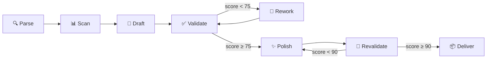

# 📜 Nirvana README Architect (NRA)

> Squad AIOS que genera el README.md perfecto para cualquier proyecto — combina análisis profundo del codebase, selección inteligente de plantillas, todas las funcionalidades de GitHub Flavored Markdown, validación con checklist de 25+ puntos y pulido final.

## Índice

- [Visión General](#visión-general)
- [Agentes](#agentes)
- [Pipeline](#pipeline)
- [Primeros Pasos](#primeros-pasos)
- [Comandos](#comandos)
- [Arquitectura](#arquitectura)
- [Features GitHub Soportadas](#features-github-soportadas)
- [Checklist de Calidad](#checklist-de-calidad)
- [Solución de Problemas](#solución-de-problemas)
- [Contribuir](#contribuir)
- [Licencia](#licencia)

---

## Visión General

**Nirvana README Architect** es un squad de 5 agentes especializados que trabajan en pipeline para transformar cualquier codebase en un README de nivel profesional.

A diferencia de generadores simples que producen plantillas genéricas, NRA:

- **Analiza** el codebase real (tech stack, scripts, variables de entorno, estructura de directorios)
- **Selecciona** la plantilla ideal por tipo de proyecto (Library, CLI, Web App, API, Monorepo, Mobile, Squad)
- **Genera** contenido usando **todas** las features de GitHub Flavored Markdown
- **Valida** con checklist de 25+ puntos y scoring automático
- **Pule** con badges, TOC, secciones colapsables y espaciado perfecto

> [!TIP]
> Puntuación mínima para entrega: **90/100**. NRA retrabaja automáticamente hasta alcanzar este nivel.

## Agentes

| Agente | Persona | Arquetipo | Función |
|:-------|:--------|:----------|:--------|
| `nra-orchestrator` | **Quill** | FlowMaster | Orquesta el pipeline completo, parseo de requests, entrega final |
| `nra-codebase-analyzer` | **Prism** | Seeker | Análisis profundo del codebase |
| `nra-content-architect` | **Serif** | Architect | Selección de plantilla y generación de contenido |
| `nra-quality-validator` | **Lens** | Guardian | Validación con checklist de 25+ puntos |
| `nra-polisher` | **Gloss** | Alchemist | Pulido final: badges, TOC, secciones colapsables |

## Pipeline



| Fase | Agente | Descripción |
|:-----|:-------|:------------|
| **Parse** | Quill | Identifica proyecto, tipo y alcance |
| **Scan** | Prism | Análisis profundo del codebase |
| **Draft** | Serif | Selecciona plantilla y genera contenido |
| **Validate** | Lens | Checklist 25+ puntos, scoring |
| **Rework** | Serif | Retrabajo si score < 75 (máx 2x) |
| **Polish** | Gloss | TOC, badges, espaciado |
| **Revalidate** | Lens | Confirma score ≥ 90 |
| **Deliver** | Quill | Entrega con métricas |

## Primeros Pasos

> [!NOTE]
> Este squad funciona dentro del ecosistema **Synkra AIOS** y requiere Claude Code con el framework configurado.

```bash
# Clonar
git clone https://github.com/gutomec/nirvana-readme-architect.git

# Instalar como squad
squads install gutomec/nirvana-readme-architect

# Usar
@nra-orchestrator
*readme {ruta-del-proyecto}
```

## Comandos

| Comando | Descripción | Agente |
|:--------|:-----------|:-------|
| `*readme {proyecto} [tipo]` | Pipeline completo | Quill |
| `*readme-full` | Todas las 12+ secciones | Quill |
| `*readme-quick` | 6 secciones esenciales | Quill |
| `*scan` | Análisis profundo | Prism |
| `*validate` | Validación con checklist | Lens |
| `*polish` | Pulido visual | Gloss |

## Arquitectura

<details>
<summary>Expandir árbol de directorios</summary>

```text
nirvana-readme-architect/
├── agents/          # 5 agentes especializados
├── tasks/           # 7 tareas ejecutables
├── workflows/       # Pipeline de generación
├── checklists/      # 25+ puntos de validación
├── templates/       # Plantilla master con GFM
├── config/          # Estándares y tech stack
└── squad.yaml       # Manifiesto del squad
```

</details>

## Features GitHub Soportadas

Alerts, Mermaid Diagrams, Tables, Collapsed Sections, Task Lists, Footnotes, Badges (shields.io), Emojis, kbd Tags, Code Blocks, Diff Blocks, Reference Links — **12 features completas**.

## Checklist de Calidad

| Puntuación | Nivel | Acción |
|:-----------|:------|:-------|
| 90-100 | 🏆 Nirvana | Entregar |
| 75-89 | ⭐ Bueno | Enviar a pulido |
| 60-74 | ⚠️ Aceptable | Retrabajar |
| < 60 | ❌ Insuficiente | Retrabajar con feedback |

## Solución de Problemas

| Problema | Solución |
|:---------|:---------|
| Score bajo | Proporcionar datos manualmente via `*readme-full` |
| Plantilla incorrecta | Especificar tipo: `*readme {proyecto} api` |
| Mermaid no renderiza | Lens detecta y corrige automáticamente |

## Contribuir

Las contribuciones son bienvenidas. Siga [Conventional Commits](https://www.conventionalcommits.org/) para mensajes de commit.

## Licencia

Licenciado bajo **MIT** — ver [LICENSE](./LICENSE).

---

<div align="center">

Hecho con ❤️ por [Synkra AIOS](https://github.com/gutomec)

**[Português](./README.md)** · **[English](./README.en.md)** · **[العربية](./README.ar.md)** · **[हिन्दी](./README.hi.md)** · **[简体中文](./README.zh-CN.md)**

</div>
