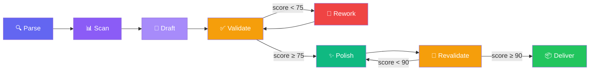

# 📜 Nirvana README Architect (NRA)

> Squad AIOS que gera o README.md perfeito para qualquer projeto — combina análise profunda de codebase, seleção inteligente de template, todas as features do GitHub Flavored Markdown, validação com checklist de 25+ pontos e polimento final.

## :bookmark_tabs: Índice

- [Visão Geral](#visão-geral)
- [Agentes](#agentes)
- [Pipeline](#pipeline)
- [Primeiros Passos](#primeiros-passos)
- [Comandos](#comandos)
- [Arquitetura](#arquitetura)
- [Features GitHub Suportadas](#features-github-suportadas)
- [Checklist de Qualidade](#checklist-de-qualidade)
- [Troubleshooting](#troubleshooting)
- [Contribuindo](#contribuindo)
- [Licença](#licença)

---

## :sparkles: Visão Geral

O **Nirvana README Architect** é um squad de 5 agentes especializados que trabalham em pipeline para transformar qualquer codebase em um README de nível profissional.

Diferente de geradores simples que produzem templates genéricos, o NRA:

- **Analisa** o codebase real (tech stack, scripts, env vars, estrutura de diretórios)
- **Seleciona** o template ideal por tipo de projeto (Library, CLI, Web App, API, Monorepo, Mobile, Squad)
- **Gera** conteúdo usando **todas** as features do GitHub Flavored Markdown
- **Valida** com checklist de 25+ pontos e scoring automático
- **Polisa** com badges, TOC, collapsed sections e espaçamento perfeito

> [!TIP]
> Score mínimo para entrega: **90/100**. O NRA retrabalha automaticamente até atingir esse nível.

## :robot: Agentes

| Agente | Persona | Archetype | Função |
|:-------|:--------|:----------|:-------|
| `nra-orchestrator` | **Quill** | FlowMaster | Orquestra o pipeline completo, parse de requests, entrega final |
| `nra-codebase-analyzer` | **Prism** | Seeker | Análise profunda do codebase: tech stack, entry points, env vars, scripts |
| `nra-content-architect` | **Serif** | Architect | Seleção de template e geração de conteúdo de cada seção |
| `nra-quality-validator` | **Lens** | Guardian | Validação com checklist de 25+ pontos e scoring |
| `nra-polisher` | **Gloss** | Alchemist | Polimento final: badges, TOC, collapsed sections, espaçamento |

## :arrows_counterclockwise: Pipeline



| Fase | Agente | Descrição |
|:-----|:-------|:----------|
| **Parse** | Quill | Identifica projeto alvo, tipo e escopo |
| **Scan** | Prism | Análise profunda do codebase |
| **Draft** | Serif | Seleciona template e gera conteúdo |
| **Validate** | Lens | Checklist 25+ pontos, score |
| **Rework** | Serif | Retrabalho se score < 75 (max 2x) |
| **Polish** | Gloss | TOC, badges, espaçamento |
| **Revalidate** | Lens | Confirma score ≥ 90 |
| **Deliver** | Quill | Entrega com métricas |

## :zap: Primeiros Passos

> [!NOTE]
> Este squad funciona dentro do ecossistema **Synkra AIOS** e requer Claude Code com o framework configurado.

### 1. Clone o repositório

```bash
git clone https://github.com/gutomec/nirvana-readme-architect.git
```

### 2. Instale como squad AIOS

Copie o diretório para `squads/` do seu projeto AIOS ou use o instalador do marketplace:

```bash
squads install gutomec/nirvana-readme-architect
```

### 3. Use o squad

```bash
# Ative o orchestrador
@nra-orchestrator

# Gere o README completo
*readme {caminho-do-projeto}

# Ou modo rápido (6 seções essenciais)
*readme-quick
```

### Checklist de Setup

- [ ] Clone ou instalação do squad concluída
- [ ] Projeto AIOS configurado com `squad.yaml`
- [ ] Claude Code com acesso ao codebase alvo

## :keyboard: Comandos

| Comando | Descrição | Agente |
|:--------|:----------|:-------|
| `*readme {projeto} [tipo]` | Pipeline completo de geração | Quill |
| `*readme-full` | Todas as 12+ seções | Quill |
| `*readme-quick` | 6 seções essenciais | Quill |
| `*scan` | Análise profunda do codebase | Prism |
| `*select-template` | Seleção de template por tipo | Serif |
| `*draft-readme` | Geração de conteúdo | Serif |
| `*validate` | Validação com checklist | Lens |
| `*polish` | Polimento visual | Gloss |
| `*deliver` | Entrega final | Quill |

## :building_construction: Arquitetura

<details>
<summary>:file_folder: Expandir árvore de diretórios</summary>

```text
nirvana-readme-architect/
├── agents/
│   ├── nra-orchestrator.md          # Quill — FlowMaster
│   ├── nra-codebase-analyzer.md     # Prism — Seeker
│   ├── nra-content-architect.md     # Serif — Architect
│   ├── nra-quality-validator.md     # Lens — Guardian
│   └── nra-polisher.md              # Gloss — Alchemist
├── tasks/
│   ├── nra-orchestrator-parse-request.md
│   ├── nra-codebase-analyzer-scan-project.md
│   ├── nra-content-architect-select-template.md
│   ├── nra-content-architect-generate-sections.md
│   ├── nra-quality-validator-validate-readme.md
│   ├── nra-polisher-enhance-readme.md
│   └── nra-orchestrator-deliver.md
├── workflows/
│   └── readme-generation-pipeline.yaml
├── checklists/
│   └── readme-quality.md            # 25+ pontos de validação
├── templates/
│   └── nirvana-readme.md            # Template master com GFM features
├── config/
│   ├── coding-standards.md
│   ├── tech-stack.md
│   └── source-tree.md
├── squad.yaml                       # Manifesto do squad
└── README.md                        # Este arquivo
```

</details>

## :star2: Features GitHub Suportadas

O NRA gera READMEs que utilizam **todas** as features do GitHub Flavored Markdown:

| Feature | Exemplo | Status |
|:--------|:--------|:------:|
| Alerts | `> [!TIP]`, `> [!WARNING]`, `> [!CAUTION]` | :white_check_mark: |
| Mermaid Diagrams | `graph`, `sequenceDiagram`, `flowchart` | :white_check_mark: |
| Tables | Alinhamento, formatação | :white_check_mark: |
| Collapsed Sections | `<details><summary>` | :white_check_mark: |
| Task Lists | `- [x]`, `- [ ]` | :white_check_mark: |
| Footnotes | `[^1]` | :white_check_mark: |
| Badges (shields.io) | Build, coverage, version, license | :white_check_mark: |
| Emojis | `:rocket:`, `:sparkles:` | :white_check_mark: |
| kbd Tags | <kbd>Ctrl</kbd>+<kbd>C</kbd> | :white_check_mark: |
| Code Blocks | Com linguagem especificada | :white_check_mark: |
| Diff Blocks | `+ added`, `- removed` | :white_check_mark: |
| Reference Links | `[text][ref]` | :white_check_mark: |

## :clipboard: Checklist de Qualidade

O **nra-quality-validator** (Lens) aplica um checklist de 25+ pontos dividido em 4 categorias:

| Categoria | Peso | Critérios |
|:----------|:----:|:----------|
| **Estrutura** | 2x (Blocking) | H1, descrição, badges, TOC, instalação, uso |
| **GitHub Features** | 1x (Advisory) | Alerts, Mermaid, tables, collapsed, task lists, footnotes |
| **Conteúdo** | 2x (Blocking) | Instalação testável, exemplos reais, env vars, scripts, license |
| **Completude** | 1x (Advisory) | Prerequisites, architecture, testing, deploy, troubleshooting |

```
Score = (blocking × 60%) + (advisory × 40%) + bonus
```

| Score | Nível | Ação |
|:------|:------|:-----|
| 90-100 | :trophy: Nirvana | Entregar |
| 75-89 | :star: Bom | Enviar para polimento |
| 60-74 | :warning: Aceitável | Retrabalhar seções |
| < 60 | :x: Insuficiente | Retrabalhar com feedback detalhado |

## :sos: Troubleshooting

| Problema | Causa Provável | Solução |
|:---------|:---------------|:--------|
| Score baixo após 2 iterações | Codebase com pouca informação | Fornecer dados manualmente via `*readme-full` |
| Template incorreto | Tipo de projeto não detectado | Especificar tipo: `*readme {projeto} api` |
| Mermaid não renderiza | Sintaxe inválida | Lens detecta e corrige automaticamente |
| Badges quebrados | Owner/repo incorreto | Verificar squad.yaml e remote git |

## :handshake: Contribuindo

Contribuições são bem-vindas! Siga os passos:

1. Fork o projeto
2. Crie sua branch (`git checkout -b feature/minha-feature`)
3. Commit suas mudanças (`git commit -m 'feat: descrição'`)
4. Push para a branch (`git push origin feature/minha-feature`)
5. Abra um Pull Request

> [!NOTE]
> Este projeto segue [Conventional Commits][conventional-commits] para mensagens de commit.

## :page_with_curl: Licença

Este projeto está licenciado sob a licença **MIT** — veja o arquivo [LICENSE](./LICENSE) para detalhes.

---

<div align="center">

Feito com :heart: por [Synkra AIOS](https://github.com/gutomec)

:star: Se este squad te ajudou, considere dar uma estrela!

**[English](./README.en.md)** · **[Español](./README.es.md)** · **[العربية](./README.ar.md)** · **[हिन्दी](./README.hi.md)** · **[简体中文](./README.zh-CN.md)**

</div>

[conventional-commits]: https://www.conventionalcommits.org/pt-br/v1.0.0/


## Edição hardened Maeve v1.1.0

Esta cópia foi endurecida para uso local no Termux/Hermes:

```bash
npm install -g /caminho/para/nirvana-readme-architect-v1.1.0-maeve
nirvana-readme-architect generate --project /caminho/do/projeto --output README.md --mode=full
nirvana-readme-architect validate --readme README.md
npm run smoke
```

Melhorias: CLI operacional, smoke test, package.json, wrapper binário e comando universal `*exit` em todos os agentes.
