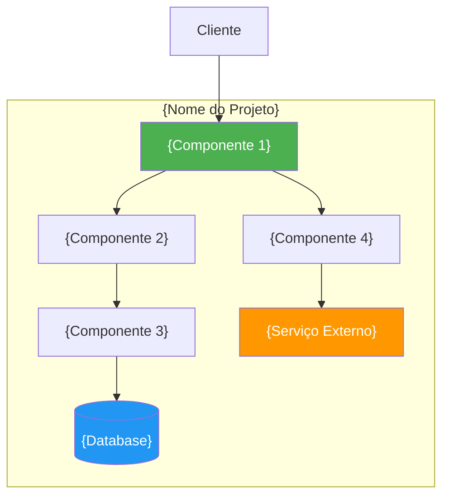
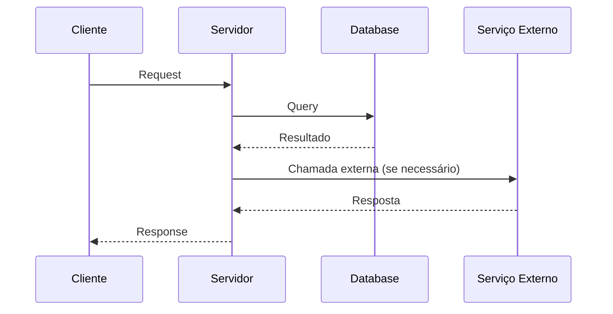

<!-- NIRVANA README TEMPLATE — Gerado pelo NRA (Nirvana README Architect) -->
<!-- Este template utiliza TODAS as features do GitHub Flavored Markdown -->
<!-- Substitua os placeholders {ENTRE_CHAVES} pelos dados reais do projeto -->

<!-- ============================================================ -->
<!-- BADGES — Alinhar em uma única linha ou grid organizado       -->
<!-- Estilo consistente: flat, flat-square, ou for-the-badge      -->
<!-- ============================================================ -->


<!-- ============================================================ -->
<!-- H1 — Apenas 1 por README. Nome do projeto + emoji opcional   -->
<!-- ============================================================ -->

# {emoji_projeto} {Nome do Projeto}

> {Descrição concisa de 1-2 frases que explica o que o projeto faz e para quem é destinado.}

<!-- ============================================================ -->
<!-- TABLE OF CONTENTS — Links âncora em kebab-case               -->
<!-- ============================================================ -->

## :bookmark_tabs: Índice

- [Visão Geral](#visão-geral)
- [Tech Stack](#tech-stack)
- [Pré-requisitos](#pré-requisitos)
- [Primeiros Passos](#primeiros-passos)
- [Arquitetura](#arquitetura)
- [Variáveis de Ambiente](#variáveis-de-ambiente)
- [Scripts Disponíveis](#scripts-disponíveis)
- [Testes](#testes)
- [Deploy](#deploy)
- [Troubleshooting](#troubleshooting)
- [Contribuindo](#contribuindo)
- [Licença](#licença)

---

<!-- ============================================================ -->
<!-- VISÃO GERAL — O que é, por que existe, para quem             -->
<!-- ============================================================ -->

## :sparkles: Visão Geral

{Descrição expandida do projeto. Explique **o que** o projeto faz, **por que** ele existe e **para quem** é destinado.}

{Mencione os diferenciais e funcionalidades principais.}

> [!TIP]
> {Dica rápida sobre o principal benefício do projeto ou caso de uso mais comum.}

<!-- ============================================================ -->
<!-- TECH STACK — Tabela com tecnologias, versões e propósitos    -->
<!-- ============================================================ -->

## :wrench: Tech Stack

| Tecnologia | Versão | Propósito |
|:-----------|:------:|:----------|
| {Linguagem} | `{versão}` | Linguagem principal |
| {Framework} | `{versão}` | Framework web/backend |
| {Database} | `{versão}` | Persistência de dados |
| {ORM} | `{versão}` | Mapeamento objeto-relacional |
| {Runtime} | `{versão}` | Ambiente de execução |
| {Package Manager} | `{versão}` | Gerenciamento de dependências |

<!-- ============================================================ -->
<!-- PRÉ-REQUISITOS — Task list + alert WARNING                   -->
<!-- ============================================================ -->

## :clipboard: Pré-requisitos

> [!WARNING]
> Certifique-se de que **todas** as ferramentas abaixo estão instaladas antes de prosseguir.

- [x] {Ferramenta 1} >= `{versão}` — [Download]({url})
- [ ] {Ferramenta 2} >= `{versão}` — [Download]({url})
- [ ] {Ferramenta 3} >= `{versão}` — [Download]({url})
- [ ] {Ferramenta 4} (opcional) — [Download]({url})

Verifique as versões instaladas:

```bash
{ferramenta1} --version    # >= {versão}
{ferramenta2} --version    # >= {versão}
{ferramenta3} --version    # >= {versão}
```

<!-- ============================================================ -->
<!-- PRIMEIROS PASSOS — Code blocks + task list + alerts           -->
<!-- ============================================================ -->

## :zap: Primeiros Passos

> [!NOTE]
> Siga os passos abaixo na ordem indicada para configurar o ambiente de desenvolvimento.

### 1. Clone o repositório

```bash
git clone https://github.com/{owner}/{repo}.git
cd {repo}
```

### 2. Instale as dependências

```bash
{package_manager} install
```

### 3. Configure o ambiente

```bash
cp .env.example .env
```

> [!IMPORTANT]
> Edite o arquivo `.env` com suas credenciais antes de prosseguir. Consulte a seção [Variáveis de Ambiente](#variáveis-de-ambiente) para detalhes.

### 4. Execute o projeto

```bash
{package_manager} run dev
```

### Checklist de Setup

- [ ] Repositório clonado
- [ ] Dependências instaladas
- [ ] Arquivo `.env` configurado
- [ ] Projeto executando em `http://localhost:{porta}`

<!-- ============================================================ -->
<!-- ARQUITETURA — Mermaid diagram + directory tree                -->
<!-- ============================================================ -->

## :building_construction: Arquitetura

### Diagrama de Componentes



### Fluxo de Dados



### Estrutura de Diretórios

<details>
<summary>:file_folder: Expandir árvore de diretórios</summary>

```text
{repo}/
├── src/
│   ├── {dir1}/              # {Descrição}
│   │   ├── {subdir}/        # {Descrição}
│   │   └── {subdir}/        # {Descrição}
│   ├── {dir2}/              # {Descrição}
│   │   ├── {subdir}/        # {Descrição}
│   │   └── {subdir}/        # {Descrição}
│   ├── {dir3}/              # {Descrição}
│   └── {dir4}/              # {Descrição}
├── tests/                   # Testes automatizados
├── docs/                    # Documentação
├── {config_file}            # {Descrição}
├── {config_file}            # {Descrição}
├── package.json             # Dependências e scripts
└── README.md                # Este arquivo
```

</details>

<!-- ============================================================ -->
<!-- VARIÁVEIS DE AMBIENTE — Tabela + alert IMPORTANT              -->
<!-- ============================================================ -->

## :key: Variáveis de Ambiente

> [!IMPORTANT]
> Variáveis marcadas como **Obrigatória** devem ser configuradas para o projeto funcionar.

| Variável | Descrição | Obrigatória | Default |
|:---------|:----------|:-----------:|:--------|
| `{ENV_VAR_1}` | {Descrição da variável} | :white_check_mark: | — |
| `{ENV_VAR_2}` | {Descrição da variável} | :white_check_mark: | — |
| `{ENV_VAR_3}` | {Descrição da variável} | :x: | `{valor}` |
| `{ENV_VAR_4}` | {Descrição da variável} | :x: | `{valor}` |

<details>
<summary>:page_facing_up: Exemplo de arquivo <code>.env</code></summary>

```bash
# Obrigatórias
{ENV_VAR_1}="{valor_exemplo}"
{ENV_VAR_2}="{valor_exemplo}"

# Opcionais
{ENV_VAR_3}="{valor_default}"
{ENV_VAR_4}="{valor_default}"
```

</details>

<!-- ============================================================ -->
<!-- SCRIPTS DISPONÍVEIS — Tabela com comando e descrição         -->
<!-- ============================================================ -->

## :scroll: Scripts Disponíveis

| Comando | Descrição | Uso |
|:--------|:----------|:----|
| `{pm} run dev` | Inicia o servidor de desenvolvimento | Desenvolvimento local |
| `{pm} run build` | Gera build de produção | Deploy |
| `{pm} run start` | Inicia em modo produção | Produção |
| `{pm} run test` | Executa os testes | CI/CD |
| `{pm} run lint` | Verifica estilo de código | Qualidade |
| `{pm} run typecheck` | Verifica tipos TypeScript | Qualidade |
| `{pm} run format` | Formata o código | Qualidade |

> [!TIP]
> Use `{pm} run dev` para desenvolvimento com hot-reload. As alterações são refletidas automaticamente.

<!-- ============================================================ -->
<!-- TESTES — Como rodar, framework, cobertura                    -->
<!-- ============================================================ -->

## :test_tube: Testes

### Executar todos os testes

```bash
{pm} run test
```

### Executar com cobertura

```bash
{pm} run test -- --coverage
```

### Executar testes específicos

```bash
{pm} run test -- --grep "{padrão}"
```

> [!TIP]
> Use <kbd>Ctrl</kbd>+<kbd>C</kbd> para interromper os testes em modo watch.

| Tipo | Diretório | Framework |
|:-----|:----------|:----------|
| Unitários | `tests/unit/` | {Framework de teste} |
| Integração | `tests/integration/` | {Framework de teste} |
| E2E | `tests/e2e/` | {Framework E2E} |

<!-- ============================================================ -->
<!-- DEPLOY — Steps para produção + alert CAUTION                 -->
<!-- ============================================================ -->

## :ship: Deploy

> [!CAUTION]
> Sempre execute os testes e o build antes de fazer deploy em produção.

### Build de Produção

```bash
{pm} run build
```

### Deploy via {Plataforma}

```bash
{deploy_command}
```

<details>
<summary>:whale: Deploy com Docker</summary>

```bash
# Build da imagem
docker build -t {repo}:{versão} .

# Executar container
docker run -d \
  --name {repo} \
  -p {porta}:{porta} \
  --env-file .env \
  {repo}:{versão}
```

```yaml
# docker-compose.yml
version: '3.8'
services:
  app:
    build: .
    ports:
      - "{porta}:{porta}"
    env_file:
      - .env
    restart: unless-stopped
```

</details>

<details>
<summary>:gear: CI/CD Pipeline</summary>

O projeto utiliza {CI/CD Provider} para automação:

```yaml
# .github/workflows/{workflow}.yml
name: CI/CD
on:
  push:
    branches: [main]
  pull_request:
    branches: [main]
jobs:
  build:
    runs-on: ubuntu-latest
    steps:
      - uses: actions/checkout@v4
      - uses: actions/setup-node@v4
        with:
          node-version: '{versão}'
      - run: {pm} install
      - run: {pm} run lint
      - run: {pm} run typecheck
      - run: {pm} run test
      - run: {pm} run build
```

</details>

<!-- ============================================================ -->
<!-- TROUBLESHOOTING — Tabela problema/solução + collapsed        -->
<!-- ============================================================ -->

## :sos: Troubleshooting

| Problema | Causa Provável | Solução |
|:---------|:---------------|:--------|
| `{erro_1}` | {causa} | {solução} |
| `{erro_2}` | {causa} | {solução} |
| `{erro_3}` | {causa} | {solução} |
| Porta `{porta}` em uso | Outro processo na porta | `lsof -i :{porta}` e encerrar |
| Dependências desatualizadas | Lock file inconsistente | `rm -rf node_modules && {pm} install` |

<details>
<summary>:mag: Diagnóstico detalhado</summary>

### Verificar logs

```bash
{pm} run dev 2>&1 | tee debug.log
```

### Verificar variáveis de ambiente

```bash
# Verificar se todas as obrigatórias estão definidas
{pm} run env:check
```

### Limpar cache

```bash
rm -rf node_modules .next .cache
{pm} install
```

</details>

<!-- ============================================================ -->
<!-- CONTRIBUINDO — Guidelines + footnotes                        -->
<!-- ============================================================ -->

## :handshake: Contribuindo

Contribuições são bem-vindas! Siga os passos abaixo:

1. Fork o projeto
2. Crie sua branch (`git checkout -b feature/{nome-da-feature}`)
3. Commit suas mudanças (`git commit -m 'feat: {descrição}'`)
4. Push para a branch (`git push origin feature/{nome-da-feature}`)
5. Abra um Pull Request

> [!NOTE]
> Este projeto segue [Conventional Commits][conventional-commits] para mensagens de commit.

### Padrões de Commit

| Tipo | Descrição |
|:-----|:----------|
| `feat:` | Nova funcionalidade |
| `fix:` | Correção de bug |
| `docs:` | Atualização de documentação |
| `style:` | Formatação (sem mudança de código) |
| `refactor:` | Refatoração de código |
| `test:` | Adição ou correção de testes |
| `chore:` | Tarefas de manutenção |

Consulte o [Guia de Contribuição](./CONTRIBUTING.md) para mais detalhes[^1].

<!-- ============================================================ -->
<!-- CHANGELOG — Diff blocks para mudanças recentes               -->
<!-- ============================================================ -->

<details>
<summary>:newspaper: Changelog Recente</summary>

### v{versão} ({data})

```diff
+ Adicionado: {feature nova}
+ Adicionado: {feature nova}
! Alterado: {mudança em feature existente}
- Removido: {feature removida}
# Corrigido: {bug fix}
```

### v{versão_anterior} ({data})

```diff
+ Adicionado: {feature}
! Alterado: {mudança}
# Corrigido: {bug fix}
```

</details>

<!-- ============================================================ -->
<!-- LICENÇA                                                       -->
<!-- ============================================================ -->

## :page_with_curl: Licença

Este projeto está licenciado sob a licença **{Tipo de Licença}** — veja o arquivo [LICENSE](./LICENSE) para detalhes.

---

<div align="center">

Feito com :heart: por [{autor}]({url_autor})

:star: Se este projeto te ajudou, considere dar uma estrela!

</div>

<!-- ============================================================ -->
<!-- FOOTNOTES — Referências externas                             -->
<!-- ============================================================ -->

[^1]: O guia de contribuição detalha o processo de review, testes necessários e padrões de código.

<!-- ============================================================ -->
<!-- REFERENCE-STYLE LINKS                                        -->
<!-- ============================================================ -->

[conventional-commits]: https://www.conventionalcommits.org/pt-br/v1.0.0/
