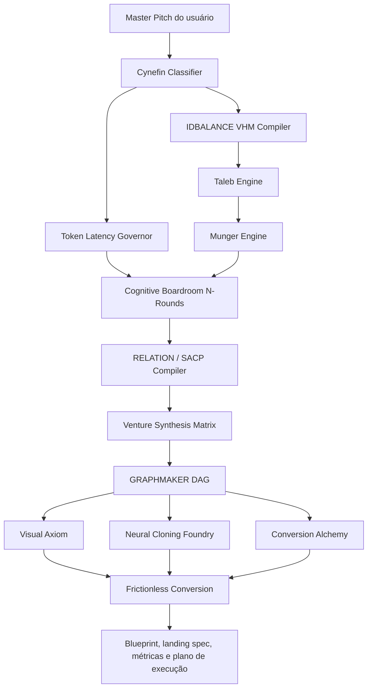
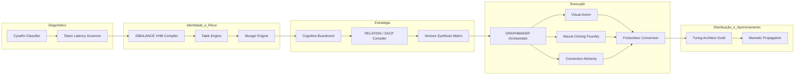
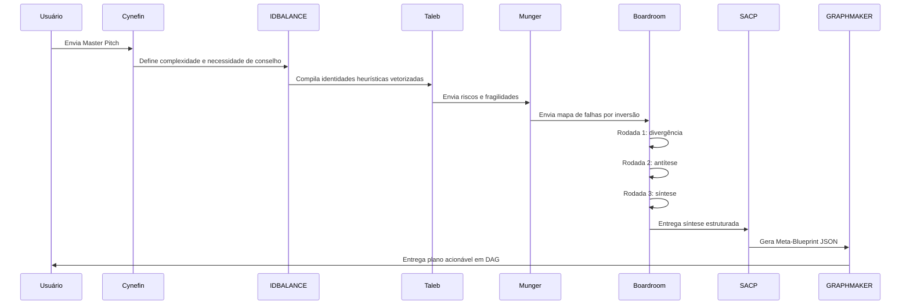

# 🧠 OMNISCIENT GRAPHMAKER Squad v6.5

### Um ecossistema multiagente para transformar um Master Pitch em estratégia, blueprint quantitativo e execução tática em DAG.

  
  
  
  

---

## ✨ Ideia central

O **OMNISCIENT GRAPHMAKER Squad v6.5** é um sistema de agentes especializados para analisar uma ideia, tese de negócio ou produto digital e convertê-la em uma arquitetura operacional pronta para execução.

Ele evita o problema típico de conselhos multiagentes caóticos — a chamada “Torre de Babel” — substituindo debates livres por um fluxo estruturado de decisão, síntese, tradução para JSON e execução por grafo de dependências.

Em termos simples: o squad pega uma ideia ampla e transforma em **blueprint estratégico, métricas, tarefas, arquitetura de execução e entregáveis acionáveis**.

---

## 🎯 Para que serve?

Este squad serve para estruturar produtos, negócios, lançamentos, squads internos e experimentos de inovação com mais rigor técnico.

Ele foi desenhado para responder perguntas como:

- A ideia é simples, complicada ou complexa?
- Quais riscos podem destruir o modelo?
- O plano é frágil, robusto ou antifrágil?
- Como transformar heurísticas qualitativas em métricas e JSON quantitativo?
- Quais agentes devem agir primeiro?
- Quais tarefas dependem de quais entregas?
- Qual orçamento de tokens, custo e latência deve ser respeitado?
- O que deve ser entregue ao final para permitir execução real?

---

## 🧭 Como o squad trabalha

---

## 🧩 Estrutura dos agentes

---

## ✦ O que cada agente faz?

<table>
<tr>
<td><b>🧭 Cynefin Classifier</b> Classifica o problema como simples, complicado, complexo ou caótico e define o tipo de roteamento.</td>
<td><b>⏱️ Token Latency Governor</b> Controla orçamento de tokens, custo, latência, cache e escolha de modelos por camada.</td>
</tr>
<tr>
<td><b>🧬 IDBALANCE VHM Compiler</b> Transforma mind-clones em matrizes de heurísticas vetorizadas para reduzir deriva de persona e alucinação cruzada.</td>
<td><b>⚠️ Taleb Engine</b> Executa teste de estresse, identifica riscos de cauda longa e avalia fragilidade ou antifragilidade.</td>
</tr>
<tr>
<td><b>🔁 Munger Engine</b> Aplica o protocolo de inversão: antes de perguntar como vencer, mapeia como o modelo pode falhar.</td>
<td><b>🏛️ Cognitive Boardroom</b> Organiza o conselho em rodadas: divergência, antítese e síntese, evitando debate caótico.</td>
</tr>
<tr>
<td><b>🧩 RELATION / SACP Compiler</b> Converte ideias abstratas e qualitativas em um Meta-Blueprint JSON estruturado e validável.</td>
<td><b>⚙️ Venture Synthesis Matrix</b> Transforma a síntese estratégica em tarefas atômicas, dependências e critérios de aceite.</td>
</tr>
<tr>
<td><b>🕸️ GRAPHMAKER Orchestrator</b> Monta o grafo de execução em DAG, indicando quais nós dependem de quais entregas.</td>
<td><b>🎨 Visual Axiom</b> Define sistema visual, branding, tokens de design e direção estética.</td>
</tr>
<tr>
<td><b>🗣️ Neural Cloning Foundry</b> Cria a lógica de tom de voz e DNA verbal do produto ou marca.</td>
<td><b>🧪 Conversion Alchemy</b> Gera copywriting, promessa, objeções, provas e chamadas para ação.</td>
</tr>
<tr>
<td><b>🚀 Frictionless Conversion</b> Integra design, voz e copy em uma especificação completa de landing page ou funil.</td>
<td><b>🛠️ Turing Architect Guild</b> Revisa falhas técnicas e aplica lógica de correção/self-healing quando necessário.</td>
</tr>
<tr>
<td><b>📣 Memetic Propagation</b> Planeja distribuição, adaptação de mensagens e loop de telemetria de mercado.</td>
<td><b>✅ Resultado integrado</b> Consolida blueprint, DAG, métricas, artefatos e plano tático de execução.</td>
</tr>
</table>

---

## ✦ Como o Conselho evita a “Torre de Babel”?

---

## 📦 O que o squad entrega no final?

<table>
<tr>
<td><b>📘 Meta-Blueprint JSON</b> Documento estruturado com classificação, VHM, riscos, inversão, síntese, métricas e governança.</td>
<td><b>🕸️ Execution DAG</b> Grafo de dependências que mostra a ordem correta de execução dos agentes e tarefas.</td>
</tr>
<tr>
<td><b>📊 Token & Latency Budget</b> Plano de custo, latência, cache e modelo por camada para evitar execução cara e lenta.</td>
<td><b>🧱 Product / Landing Spec</b> Especificação didática do produto, promessa, mecanismo, CTA, métricas e estrutura de conversão.</td>
</tr>
<tr>
<td><b>🧪 Relatório de validação</b> Evidência de que o fluxo foi executado e validado por smoke test.</td>
<td><b>🚦 Critérios de aceite</b> Conjunto de checks para saber se a estratégia virou execução auditável.</td>
</tr>
</table>

---

### Resultado esperado

**Uma ideia abstrata entra.** 
**Um blueprint quantitativo, um DAG de execução e artefatos táticos saem.**

 

<b>Licença:</b> MIT 
<b>Criado por:</b> Marcio Bisognin 
<b>Instagram:</b> @marciobisognin

