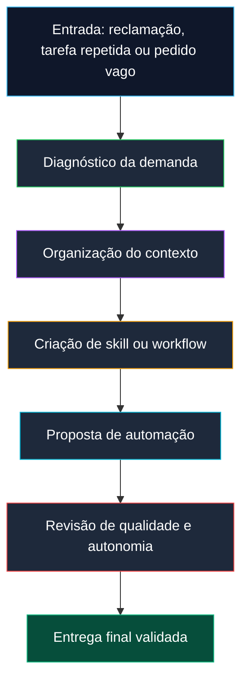
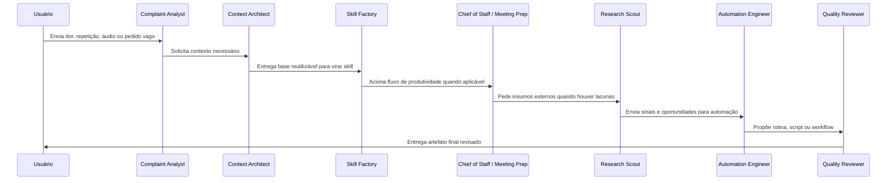
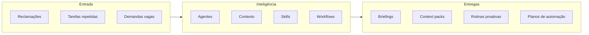

# 🧠 Proactive AI OS Squad

### Um sistema agentivo para transformar dores recorrentes em contexto, skills, agentes, workflows e automações proativas.

  
  
  

---

## ✨ O que é este Squad

O **Proactive AI OS Squad** é uma equipe de agentes de IA desenhada para transformar reclamações, demandas vagas e tarefas repetitivas em um sistema operacional de trabalho com IA.

Em vez de tratar a IA apenas como um chat reativo, o squad organiza a demanda em **contexto reutilizável**, **skills**, **agentes especialistas**, **workflows operacionais** e **rotinas proativas**. O resultado é um modo mais estruturado de usar IA para produtividade, gestão, preparação de reuniões, pesquisa, revisão semanal e automação de processos.

---

## 🎯 Para que serve

<table>
<tr>
<td width="33%" valign="top">

### 🧩 Transformar dor em sistema
Converte frases como “faço isso toda semana” ou “perco tempo preparando reuniões” em fluxos claros, reaproveitáveis e melhoráveis.

</td>
<td width="33%" valign="top">

### 🗂️ Criar contexto reutilizável
Organiza perfil, projetos, decisões, preferências, exemplos e critérios em arquivos Markdown fáceis de manter e reaproveitar.

</td>
<td width="33%" valign="top">

### ⚙️ Propor automações seguras
Indica quando uma tarefa deve virar prompt, skill, workflow, script, briefing recorrente ou automação com validação humana.

</td>
</tr>
</table>

---

## 🧭 Visão geral do funcionamento

---

## 🧩 Estrutura dos agentes

<table>
<tr>
<th>Agente</th>
<th>O que faz</th>
<th>O que produz</th>
</tr>
<tr>
<td><strong>Complaint-to-System Analyst</strong></td>
<td>Interpreta reclamações, fricções operacionais e pedidos vagos para descobrir a real oportunidade de sistematização.</td>
<td>Diagnóstico da dor, tipo de solução recomendada e perguntas críticas.</td>
</tr>
<tr>
<td><strong>Context Architect</strong></td>
<td>Transforma informação dispersa em contexto organizado, legível e reutilizável por outros agentes.</td>
<td>Context packs, perfis, diretrizes, princípios de decisão e exemplos.</td>
</tr>
<tr>
<td><strong>Skill Factory Agent</strong></td>
<td>Converte processos repetidos em skills reutilizáveis com gatilhos, etapas, critérios e validações.</td>
<td>Arquivos <code>SKILL.md</code>, critérios de uso e padrões de execução.</td>
</tr>
<tr>
<td><strong>Chief of Staff Agent</strong></td>
<td>Conecta prioridades, tarefas, agenda, reuniões e decisões para orientar foco operacional.</td>
<td>Briefings executivos, prioridades e recomendações de acompanhamento.</td>
</tr>
<tr>
<td><strong>Research Scout</strong></td>
<td>Monitora tendências, referências, concorrentes, oportunidades e sinais externos relevantes.</td>
<td>Radar de informação, sínteses acionáveis e insumos para decisão.</td>
</tr>
<tr>
<td><strong>Meeting Prep Agent</strong></td>
<td>Prepara reuniões com contexto, objetivos, pauta, riscos, perguntas e resultados esperados.</td>
<td>Briefing pré-reunião e roteiro de condução.</td>
</tr>
<tr>
<td><strong>Automation Engineer</strong></td>
<td>Avalia se uma rotina deve virar script, cron job, integração ou fluxo automatizado.</td>
<td>Plano de automação, protótipos de scripts e recomendações técnicas.</td>
</tr>
<tr>
<td><strong>Quality & Autonomy Reviewer</strong></td>
<td>Revisa clareza, riscos, confiabilidade, limites de autonomia e necessidade de validação humana.</td>
<td>Checklist de qualidade, riscos e critérios de aprovação.</td>
</tr>
</table>

---

## 🗺️ Como os agentes se conectam

---

## 📦 O que o Squad entrega no final

<table>
<tr>
<td width="50%" valign="top">

### ✅ Diagnóstico de sistematização
Define se a demanda deve virar prompt, skill, agente, workflow, arquivo de contexto, script ou rotina recorrente.

### ✅ Context pack
Entrega arquivos Markdown com perfil, projetos, voz, decisões, critérios e exemplos para alimentar outros agentes.

### ✅ Skills reutilizáveis
Gera habilidades operacionais, como transformação de reclamações em skills, engenharia de contexto e briefing matinal.

</td>
<td width="50%" valign="top">

### ✅ Workflows operacionais
Organiza rotinas como briefing matinal, revisão semanal, preparação de reuniões e geração de skills.

### ✅ Protótipos de automação
Inclui scripts iniciais para montar contexto, gerar briefing e propor skill a partir de uma reclamação.

### ✅ Governança da autonomia
Inclui revisão crítica para evitar automação cega, erro silencioso ou dependência excessiva da IA.

</td>
</tr>
</table>

---

## 🧱 Arquitetura resumida

---

## ✅ Em uma frase

> O **Proactive AI OS Squad** transforma problemas repetidos em um sistema agentivo organizado, reutilizável, validado e proativo.

**Licença:** MIT 
**Criado por:** Marcio Bisognin 
**Instagram:** [@marciobisognin](https://instagram.com/marciobisognin)

