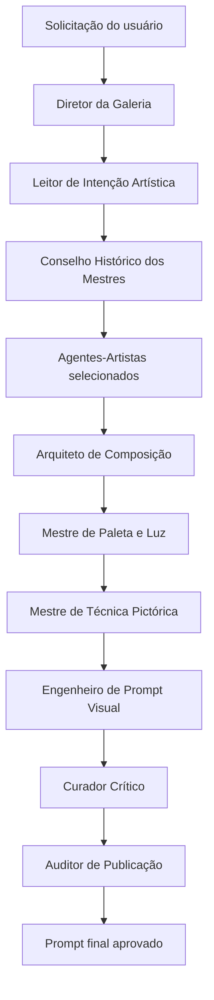
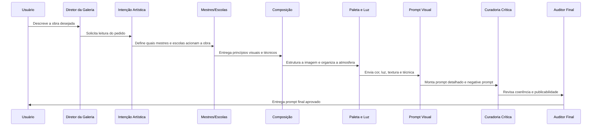

# 🔥 Prometheus Artis — Galeria dos Mestres

### Uma supergaleria de arte multiagente para transformar ideias em prompts visuais de nível museológico.

  
  
  
  

---

## ✨ O que é este Squad

**Prometheus Artis — Galeria dos Mestres** é um squad de curadoria artística e engenharia de prompt visual. Ele funciona como uma **supergaleria de arte digital**: recebe a solicitação do usuário, interpreta a intenção estética, convoca agentes especialistas em períodos e mestres da história da arte, organiza composição, paleta, luz e técnica pictórica, e entrega um prompt final pronto para gerar uma obra visual por inteligência artificial.

O nome remete a **Prometeu**, símbolo mítico do fogo criador, da técnica e da capacidade humana de transformar ideia em forma. Aqui, esse fogo criador é aplicado à geração de imagens com IA, com método, curadoria e refinamento artístico.

---

## 🎯 Para que serve

<table>
<tr>
<td><strong>🎨 Criar prompts artísticos premium</strong> Transforma ideias simples em prompts ricos, com sujeito, ambiente, composição, luz, paleta, técnica, atmosfera e estilo visual.</td>
<td><strong>🏛️ Simular uma curadoria de galeria</strong> Seleciona influências de períodos artísticos e mestres compatíveis com a intenção da obra.</td>
<td><strong>✅ Validar publicabilidade</strong> Revisa coerência, originalidade, clareza do prompt e qualidade visual antes da entrega final.</td>
</tr>
</table>

---

## 🧭 Como o Squad trabalha

---

## 🧩 Estrutura dos agentes

O squad possui **48 agentes** organizados em duas camadas: uma camada de orquestração/curadoria e uma camada de agentes-artistas.

### Camada 1 — Agentes principais

<table>
<tr><th>Agente</th><th>O que faz</th></tr>
<tr><td><strong>Diretor da Galeria</strong></td><td>Orquestra todo o fluxo, define quais especialistas serão ativados e consolida a visão final.</td></tr>
<tr><td><strong>Leitor de Intenção Artística</strong></td><td>Transforma o pedido do usuário em briefing visual estruturado: tema, emoção, finalidade, formato e restrições.</td></tr>
<tr><td><strong>Historiador dos Primórdios</strong></td><td>Acrescenta fundamentos da arte rupestre, antiga, egípcia, grega, romana e simbólica.</td></tr>
<tr><td><strong>Curador Medieval e Bizantino</strong></td><td>Contribui com iconografia, ouro, vitrais, iluminuras, espiritualidade visual e composição hierárquica.</td></tr>
<tr><td><strong>Curador Renascentista</strong></td><td>Organiza perspectiva, anatomia, proporção, equilíbrio, sfumato e composição clássica.</td></tr>
<tr><td><strong>Curador Barroco</strong></td><td>Amplia drama, chiaroscuro, tenebrismo, teatralidade, luz direcional e presença cênica.</td></tr>
<tr><td><strong>Curador Romântico e Simbolista</strong></td><td>Traz sublime, paisagem emocional, sonho, mistério, símbolo e tensão psicológica.</td></tr>
<tr><td><strong>Curador Impressionista e Pós-Impressionista</strong></td><td>Modula luz, cor, pincelada, atmosfera, percepção ótica e vibração cromática.</td></tr>
<tr><td><strong>Curador Modernista</strong></td><td>Introduz ruptura formal, abstração, cubismo, surrealismo, cor pura e síntese visual.</td></tr>
<tr><td><strong>Curador Contemporâneo</strong></td><td>Atualiza a obra para linguagem digital, pop, urbana, identitária, generativa e editorial.</td></tr>
<tr><td><strong>Arquiteto de Composição</strong></td><td>Define ponto focal, perspectiva, profundidade, hierarquia visual, simetria, tensão e ritmo.</td></tr>
<tr><td><strong>Mestre de Paleta e Luz</strong></td><td>Define cores, contrastes, temperatura, luz principal, luz de recorte, textura e atmosfera.</td></tr>
<tr><td><strong>Mestre de Técnica Pictórica</strong></td><td>Escolhe óleo, afresco, aquarela, carvão, colagem, mixed media, pintura digital ou render pictórico.</td></tr>
<tr><td><strong>Engenheiro de Prompt Visual</strong></td><td>Converte toda a curadoria em prompt principal, negative prompt, versão curta e parâmetros por ferramenta.</td></tr>
<tr><td><strong>Curador Crítico</strong></td><td>Avalia coerência estética, excesso de estilos, originalidade e qualidade museológica.</td></tr>
<tr><td><strong>Auditor de Publicação</strong></td><td>Executa o gate final e decide se a entrega está aprovada ou precisa de revisão.</td></tr>
</table>

### Camada 2 — Agentes-artistas

<table>
<tr>
<td><strong>Renascimento</strong> Leonardo da Vinci, Michelangelo, Rafael, Botticelli, Ticiano.</td>
<td><strong>Barroco</strong> Caravaggio, Rembrandt, Vermeer, Rubens, Velázquez.</td>
<td><strong>Romântico / Simbolista</strong> Goya, Turner, Delacroix, Caspar David Friedrich, Odilon Redon.</td>
</tr>
<tr>
<td><strong>Impressionismo / Pós</strong> Monet, Degas, Van Gogh, Cézanne, Seurat.</td>
<td><strong>Modernismo</strong> Picasso, Matisse, Kandinsky, Mondrian, Dalí, Miró.</td>
<td><strong>Contemporâneo</strong> Frida Kahlo, Rothko, Pollock, Warhol, Basquiat, Yayoi Kusama.</td>
</tr>
</table>

Cada agente-artista não copia obras existentes. Ele contribui com **fundamentos técnicos abstratos**: composição, luz, paleta, gesto, textura, atmosfera, ritmo visual e linguagem pictórica.

---

## 🗺️ Fluxo didático da curadoria

---

## 📦 O que o squad entrega no final

<table>
<tr><th>Entrega</th><th>Descrição</th></tr>
<tr><td><strong>Leitura artística</strong></td><td>Interpretação do pedido do usuário em linguagem visual clara.</td></tr>
<tr><td><strong>Direção curatorial</strong></td><td>Lista de agentes, escolas e influências artísticas acionadas, com justificativa.</td></tr>
<tr><td><strong>Composição visual</strong></td><td>Plano, perspectiva, ponto focal, profundidade, equilíbrio, ritmo e hierarquia.</td></tr>
<tr><td><strong>Paleta, luz e atmosfera</strong></td><td>Cores principais, contraste, temperatura, iluminação, textura e emoção visual.</td></tr>
<tr><td><strong>Técnica pictórica</strong></td><td>Indicação de linguagem visual: óleo, afresco, aquarela, carvão, arte digital, mixed media etc.</td></tr>
<tr><td><strong>Prompt principal</strong></td><td>Prompt altamente detalhado para gerar a imagem em IA.</td></tr>
<tr><td><strong>Negative prompt</strong></td><td>Lista de elementos a evitar: baixa qualidade, deformações, marcas d’água, estilos conflitantes etc.</td></tr>
<tr><td><strong>Parâmetros sugeridos</strong></td><td>Aspect ratio, stylize, CFG, steps, seed e recomendações conforme a ferramenta de imagem.</td></tr>
<tr><td><strong>Selo curatorial</strong></td><td>Decisão final: <strong>APROVADO</strong> ou <strong>REVISAR</strong>, com justificativa.</td></tr>
</table>

---

## ✅ Em uma frase

> O **Prometheus Artis** é uma galeria de mestres dentro de um squad: ele recebe uma intenção visual, convoca os agentes artísticos certos e devolve um prompt original, refinado e pronto para gerar uma obra de arte por inteligência artificial.

**Licença:** MIT 
**Criado por:** Marcio Bisognin 
**Instagram:** [@marciobisognin](https://instagram.com/marciobisognin)

