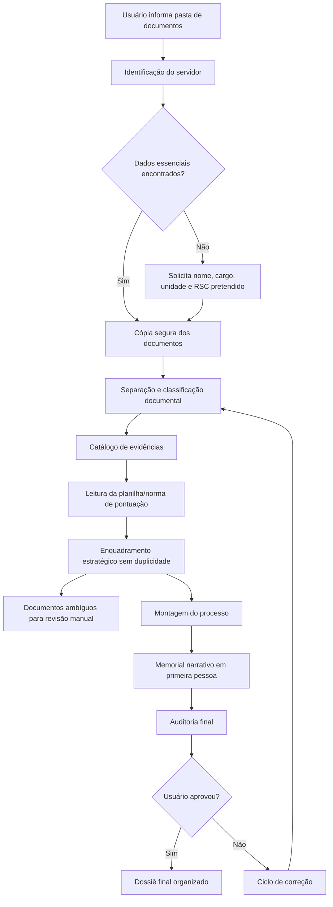
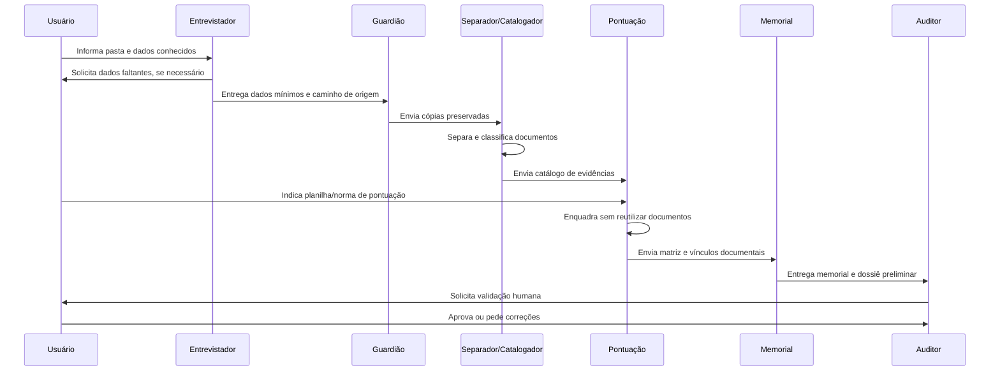

<div align="center">

# 🧭 Trajetória Evidenciada Squad

### Organize documentos funcionais, encontre a melhor pontuação possível e gere um memorial RSC humano, auditável e pronto para revisão.

<p>
  
  
  
  
</p>

</div>

---

## ✨ O que é este Squad

O **Trajetória Evidenciada Squad** é um conjunto de agentes especializados para apoiar a montagem de processos de **Reconhecimento de Saberes e Competências — RSC/PCCTAE/TAE**.

Ele transforma uma pasta de documentos funcionais — portarias, ordens de serviço, certificados, declarações, comprovantes de eventos, comissões e demais evidências — em um **dossiê organizado, pontuado, narrado e auditável**.

O squad não substitui a comissão avaliadora e não promete deferimento. Ele atua como uma camada de organização técnica, estratégia documental, narrativa memorialística e auditoria humana assistida.

---

## 🎯 Para que serve

<table>
<tr>
<td width="33%" valign="top">

### 📂 Organizar documentos

Copia a documentação indicada pelo usuário, preserva os originais e separa documentos por tipo, data, número e assunto.

</td>
<td width="33%" valign="top">

### 🧮 Apoiar a pontuação

Lê a planilha ou norma indicada e sugere o enquadramento mais vantajoso, evitando usar o mesmo documento em mais de uma pontuação.

</td>
<td width="33%" valign="top">

### 📝 Construir o memorial

Gera memorial em primeira pessoa, humanizado e centrado em saberes, competências e contribuição institucional.

</td>
</tr>
</table>

---

## 🧭 Como o Squad trabalha



---

## 🧩 Estrutura dos agentes

<table>
<tr>
<td width="50%" valign="top">

### 1. Entrevistador de Dados do Servidor

Identifica nome completo, cargo, unidade, RSC pretendido e caminhos dos arquivos. Se a informação não aparecer nos documentos, pede ao usuário.

**Produz:** `00_dados_servidor.json`

</td>
<td width="50%" valign="top">

### 2. Guardião dos Originais

Preserva os arquivos originais e trabalha apenas com cópias. Registra trilha de auditoria para evitar perda ou alteração indevida.

**Produz:** manifesto de cópia e workspace seguro.

</td>
</tr>
<tr>
<td width="50%" valign="top">

### 3. Separador Documental

Separa PDFs compostos e identifica documentos individuais: portarias, certificados, ordens de serviço, declarações, palestras, simpósios e outros.

**Produz:** documentos lógicos separados.

</td>
<td width="50%" valign="top">

### 4. Catalogador de Evidências

Extrai tipo, número, data, assunto, emissor, período, páginas e nível de confiança de cada documento.

**Produz:** `01_catalogo_documentos.csv`

</td>
</tr>
<tr>
<td width="50%" valign="top">

### 5. Leitor da Pontuação

Lê a planilha, regulamento ou matriz indicada pelo usuário e converte critérios em estrutura operacional.

**Produz:** critérios normalizados para análise.

</td>
<td width="50%" valign="top">

### 6. Estrategista de Enquadramento

Relaciona documentos com critérios, seleciona a alternativa mais vantajosa e respeita a regra de uso único do documento.

**Produz:** `02_matriz_pontuacao.csv`

</td>
</tr>
<tr>
<td width="50%" valign="top">

### 7. Arquiteto do Processo

Organiza a sequência do dossiê: capa, dados, planilha, memorial, documentos comprobatórios, anexos e revisão manual.

**Produz:** `05_ordem_processo.md`

</td>
<td width="50%" valign="top">

### 8. Narrador do Memorial

Redige o memorial em primeira pessoa, evitando relato mecânico de documentos. O foco é a trajetória, os saberes e as competências desenvolvidas.

**Produz:** `04_memorial_primeira_pessoa.md`

</td>
</tr>
<tr>
<td colspan="2" valign="top">

### 9. Auditor RSC

Revisa duplicidades, lacunas, documentos sem uso, pontuação frágil, ambiguidades e coerência narrativa. Conduz o ciclo de correção com o usuário.

**Produz:** `06_relatorio_auditoria.md`

</td>
</tr>
</table>

---

## 🔄 Fluxo operacional dos agentes



---

## 📦 O que o Squad entrega no final

<table>
<tr>
<td width="50%" valign="top">

### Arquivos estruturados

- `00_dados_servidor.json`
- `01_catalogo_documentos.csv`
- `02_matriz_pontuacao.csv`
- `05_ordem_processo.md`
- `06_relatorio_auditoria.md`

</td>
<td width="50%" valign="top">

### Materiais de processo

- `03_revisao_manual/`
- `04_memorial_primeira_pessoa.md`
- `processo_final/`
- trilha de auditoria
- pendências para revisão do usuário

</td>
</tr>
</table>

---

## 🚀 Tutorial: como executar este Squad em agentes de código

> A forma mais simples é abrir esta pasta do squad no agente escolhido e pedir para ele seguir o `README.md`, o `squad.yaml`, o workflow `workflows/pipeline-processo-rsc.yaml` e os agentes em `agents/`.

### 1. Google Antigravity

**Instalação/documentação oficial:**

- [Google Antigravity — Getting started](https://antigravity.google/docs/get-started)
- [Codelab oficial — Getting Started with Google Antigravity](https://codelabs.developers.google.com/getting-started-google-antigravity)

**Como usar:**

1. Instale e abra o Google Antigravity.
2. Clone este repositório ou baixe o ZIP do squad.
3. Abra a pasta:

```bash
squads/trajetoria-evidenciada-squad
```

4. No chat/agente do Antigravity, use um prompt como:

```text
Você está operando o Trajetória Evidenciada Squad.
Leia README.md, squad.yaml e workflows/pipeline-processo-rsc.yaml.
Siga os agentes em agents/.
Objetivo: organizar um processo RSC a partir da pasta de documentos que vou indicar.
Não apague arquivos originais. Trabalhe apenas com cópias.
Se nome completo, cargo, unidade ou RSC pretendido não forem encontrados, pergunte ao usuário.
Ao final, gere catálogo documental, matriz de pontuação, pasta de revisão manual, memorial em primeira pessoa e relatório de auditoria.
```

---

### 2. OpenCode

**Instalação/documentação oficial:**

- [OpenCode Docs](https://dev.opencode.ai/docs)

**Exemplo de execução:**

```bash
# dentro do repositório Squads-Genius
cd squads/trajetoria-evidenciada-squad
opencode
```

Depois, envie ao OpenCode:

```text
Leia README.md, squad.yaml e workflows/pipeline-processo-rsc.yaml.
Atue como orquestrador do Trajetória Evidenciada Squad.
Use os agentes em agents/ para executar o pipeline RSC.
Primeiro peça o caminho da documentação do servidor e o caminho da planilha/norma de pontuação.
Nunca apague os originais. Crie cópias de trabalho.
```

Para testar a demo incluída no squad:

```bash
python scripts/validate_package.py
python scripts/trajetoria_evidenciada_demo.py \
  --input examples/demo_process.json \
  --output output/demo
```

---

### 3. OpenAI Codex CLI

**Instalação/documentação oficial:**

- [Codex CLI no npm](https://www.npmjs.com/package/@openai/codex)
- [Repositório oficial OpenAI Codex](https://github.com/openai/codex)
- [Documentação de instalação](https://openai-codex.mintlify.app/installation)

**Instalação típica:**

```bash
npm i -g @openai/codex
# ou, no macOS:
brew install --cask codex
```

**Exemplo de execução:**

```bash
cd squads/trajetoria-evidenciada-squad
codex
```

Prompt sugerido para o Codex:

```text
Leia README.md, squad.yaml, workflows/pipeline-processo-rsc.yaml e todos os agentes em agents/.
Execute este squad como um pipeline de organização RSC.
Comece verificando se existem dados do servidor e pergunte o que faltar.
Depois solicite o caminho da documentação e da planilha de pontuação.
Preserve originais, crie cópias, catalogue documentos, sugira enquadramento sem duplicidade, separe revisão manual, escreva memorial humanizado em primeira pessoa e gere relatório de auditoria.
```

---

## ✅ Em uma frase

> O **Trajetória Evidenciada Squad** converte documentos funcionais dispersos em um processo RSC organizado, pontuado, narrado e auditável, preservando os originais e mantendo revisão humana obrigatória.

<div align="center">

**Licença:** MIT<br>
**Criado por:** Marcio Bisognin<br>
**Instagram:** [@marciobisognin](https://instagram.com/marciobisognin)

</div>

---

## 🤝 Como usar nos principais LLMs de codificação

> [!NOTE]
> **O padrão de ativação é o mesmo em qualquer ferramenta:**
> 1. **Dê contexto** ao assistente apontando os arquivos do squad (especialmente `squads/trajetoria-evidenciada-squad/squad.yaml`).
> 2. **Peça que ele assuma a persona do orquestrador** (veja os agentes em `squads/trajetoria-evidenciada-squad/agents/`).
> 3. **Conduza o fluxo** respeitando os checkpoints humanos e validando cada handoff/contrato.
>
> **Prompt de ativação** (copie, cole e ajuste o briefing):
> ```text
> Assuma a persona do orquestrador do squad (veja os agentes em `squads/trajetoria-evidenciada-squad/agents/`)
> e conduza o fluxo definido em `squads/trajetoria-evidenciada-squad/`.
> Valide cada handoff/contrato e respeite os checkpoints humanos.
> Meu briefing é: <descreva seu objetivo, materiais e formato de saída>.
> ```

<details open>
<summary><b>🟣 Claude Code (CLI / Web / IDE) — recomendado</b></summary>

<br>

```bash
# No terminal, dentro do repositório
claude

> Leia @squads/trajetoria-evidenciada-squad/squad.yaml e assuma a persona do orquestrador do squad.
  Conduza o fluxo para o briefing: <...>
```
- Use **`@caminho/arquivo`** para dar contexto preciso (autocompleta no prompt).
- Disponível em **CLI, app desktop/web (claude.ai/code) e extensões VS Code / JetBrains**.

</details>

<details>
<summary><b>🟦 Cursor</b></summary>

<br>

1. Abra a pasta do repositório no Cursor.
2. No **Chat / Composer (⌘/Ctrl + I)**, referencie os arquivos com `@`:
   ```text
   @squads/trajetoria-evidenciada-squad/squad.yaml
   Assuma a persona do orquestrador e conduza o fluxo para o briefing: <...>
   ```
3. **Persistente:** crie um `.cursorrules` na raiz apontando para `squads/trajetoria-evidenciada-squad/` como squad ativo.

</details>

<details>
<summary><b>⬛ GitHub Copilot (VS Code Chat)</b></summary>

<br>

```text
@workspace #file:squads/trajetoria-evidenciada-squad/squad.yaml
Assuma a persona do orquestrador deste squad e conduza o fluxo para: <...>
```
Para regras persistentes, crie **`.github/copilot-instructions.md`** com o prompt de ativação.

</details>

<details>
<summary><b>🟩 Windsurf (Cascade)</b></summary>

<br>

```text
@squads/trajetoria-evidenciada-squad/squad.yaml
Atue como o orquestrador deste squad e execute o fluxo para: <briefing>.
```
Fixe as regras em **`.windsurfrules`** (raiz do projeto).

</details>

<details>
<summary><b>🟧 Cline / Roo Code (VS Code)</b></summary>

<br>

```text
Leia squads/trajetoria-evidenciada-squad/squad.yaml e assuma a persona do orquestrador.
Conduza o fluxo do squad e execute os scripts em squads/trajetoria-evidenciada-squad/scripts/ quando o passo pedir.
Briefing: <...>
```
O Cline/Roo pode **executar os scripts** do squad e ler a saída — aprove a execução quando solicitado.

</details>

<details>
<summary><b>🟨 Continue.dev / Aider / Zed AI / chats web</b></summary>

<br>

- **Continue.dev:** use `@file` para `squads/trajetoria-evidenciada-squad/squad.yaml`; cole o prompt de ativação.
- **Aider:** `aider squads/trajetoria-evidenciada-squad/squad.yaml` e instrua o orquestrador.
- **ChatGPT / Gemini (sem acesso a arquivos):** copie o conteúdo de `squads/trajetoria-evidenciada-squad/squad.yaml` para o chat, cole o prompt de ativação e rode eventuais scripts localmente, colando a saída de volta.

</details>


---

Licença: MIT. Criado por Marcio Bisognin. Instagram: @marciobisognin.
