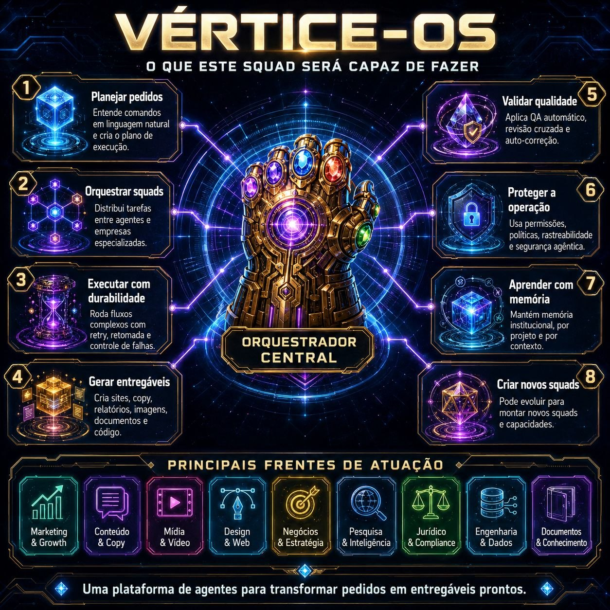
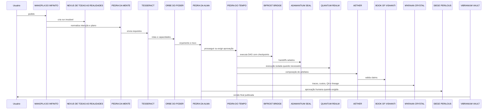

<div align="center">
  
</div>

<div align="center">
  <h1>VÉRTICE-OS</h1>
  <p><strong>PRD de arquitetura interna temática — Artefatos Marvel</strong></p>


</div>

## O que é

Este squad recria o **VÉRTICE-OS exatamente como definido no PRD enviado por Marcio**, preservando o nome principal, os IDs técnicos, os codinomes, os elementos temáticos, os papéis funcionais, os gates, o roadmap e o contrato canônico entre agentes.

A arquitetura é organizada em quatro blocos principais: **comando soberano**, **seis agentes cognitivos centrais**, **agentes operacionais de infraestrutura** e **agentes de segurança, evidência e meta-construção**.

## Nota de uso interno e propriedade

O PRD base pertence a Marcio Bisognin. Esta implementação mantém a diretriz do documento: os nomes temáticos funcionam como **codinomes internos de arquitetura**, preservando os IDs técnicos e as responsabilidades funcionais.

## Princípios de nomenclatura

| ID | Princípio | Regra |
|---|---|---|
| P1 | Sem personagens | Nenhum agente recebe nome, voz, biografia ou comportamento de personagem. |
| P2 | Artefato + função | O codinome sempre vem acompanhado do papel técnico. |
| P3 | IDs imutáveis | Mudanças futuras de branding não alteram contratos nem integrações. |
| P4 | Sem antropomorfização | Agentes são serviços cognitivos com limites, não personalidades autônomas. |
| P5 | Tema interno | A temática não substitui políticas, schemas, testes ou observabilidade. |

## Inventário dos agentes internos

| ID | Codinome | Função | Bloco |
|---|---|---|---|
| `CTL-00` | **MANOPLA DO INFINITO** | Orquestrador soberano | comando soberano |
| `CTX-00` | **NEXUS DE TODAS AS REALIDADES** | Estado global e contexto | comando soberano |
| `CORE-01` | **PEDRA DA MENTE** | Intenção e planejamento | cognitivo central |
| `CORE-02` | **TESSERACT** | Roteamento e capacidades | cognitivo central |
| `CORE-03` | **PEDRA DO TEMPO** | Runtime durável | cognitivo central |
| `CORE-04` | **AETHER** | Síntese e composição | cognitivo central |
| `CORE-05` | **ORBE DO PODER** | Recursos e orçamento | cognitivo central |
| `CORE-06` | **PEDRA DA ALMA** | Governança e HITL | cognitivo central |
| `OPS-01` | **VIBRANIUM VAULT** | Memória e artefatos | infraestrutura |
| `OPS-02` | **ADAMANTIUM SEAL** | Contratos e integridade | infraestrutura |
| `OPS-03` | **BIFROST BRIDGE** | Mensageria e handoffs | infraestrutura |
| `OPS-04` | **QUANTUM REALM** | Sandbox e simulação | infraestrutura |
| `SEC-01` | **NEGATIVE ZONE** | Quarentena e contenção | segurança |
| `QA-01` | **BOOK OF VISHANTI** | Evidência e factualidade | segurança/evidência |
| `OBS-01` | **M'KRAAN CRYSTAL** | Observabilidade e lineage | observabilidade |
| `GATE-01` | **SIEGE PERILOUS** | Gate de aprovação | governança |
| `SAFE-01` | **ULTIMATE NULLIFIER** | Kill switch e rollback | segurança crítica |
| `POL-01` | **NORN STONES** | Policy packs e regras | política |
| `ADP-01` | **QUANTUM BANDS** | Adapters de ferramentas e modelos | adaptação |
| `META-01` | **COSMIC CUBE FORGE** | Fábrica de agentes e squads | meta-construção |
| `RED-01` | **DARKHOLD CHAMBER** | Red team e testes adversariais | red team |

## Fluxo ponta a ponta de uma ordem



## Roadmap de implementação

| Fase | Agentes | Resultado |
|---|---|---|
| F0 | Manopla, Mente, Tesseract, Tempo | Kernel funcional |
| F1 | Adamantium, Bifrost, Vibranium | Contratos e memória |
| F2 | Alma, Norn, Siege Perilous | Governança e HITL |
| F3 | Negative Zone, Quantum Realm, Nullifier | Segurança operacional |
| F4 | Vishanti, M'Kraan, EvalOps | Evidência e observabilidade |
| F5 | Aether, Power Orb, Quantum Bands | Artefatos e otimização |
| F6 | Cosmic Cube Forge, Darkhold Chamber | Meta-fábrica segura |

## Critérios de aceite

| ID | Critério |
|---|---|
| AC-01 | O nome principal permanece VÉRTICE-OS em todas as interfaces e documentos. |
| AC-02 | Nenhum agente utiliza nome, imagem, fala ou identidade de personagem. |
| AC-03 | Todos os agentes possuem ID técnico, codinome, papel e manifesto versionado. |
| AC-04 | Todos os handoffs são validados pelo ADAMANTIUM SEAL. |
| AC-05 | A PEDRA DO TEMPO retoma uma execução após falha sem duplicar side effects. |
| AC-06 | A PEDRA DA ALMA bloqueia ação sensível sem consentimento ou aprovação. |
| AC-07 | NEGATIVE ZONE contém prompt injection ou artefato suspeito sem propagação. |
| AC-08 | BOOK OF VISHANTI consegue reconstruir a fonte de cada claim factual. |
| AC-09 | M'KRAAN CRYSTAL reconstrói a execução completa a partir do trace_id. |
| AC-10 | COSMIC CUBE FORGE não publica agente sem testes, benchmark e aprovação humana. |
| AC-11 | ULTIMATE NULLIFIER encerra runs e revoga credenciais dentro do SLA crítico. |
| AC-12 | A temática pode ser removida sem quebrar APIs, porque os IDs técnicos são estáveis. |

## Como executar

```bash
cd vertice-os-artefatos-marvel
python scripts/vertice_os_blueprint.py --output generated/demo
python scripts/validate_squad.py --path .
python -m unittest discover -s tests
```

## Entregas finais

- `PRD.md` — PRD extraído e preservado.
- `agents/` — 21 agentes internos exatamente com IDs e codinomes do PRD.
- `references/agent_catalog.json` — catálogo canônico do inventário.
- `schemas/canonical_envelope.schema.json` — envelope canônico entre agentes.
- `scripts/vertice_os_blueprint.py` — gerador determinístico de blueprint.
- `generated/demo/blueprint.json` — blueprint gerado.
- `validation/` — relatórios reais de smoke test, validação, testes e empacotamento.

Licença: MIT. Criado por Marcio Bisognin. Instagram: @marciobisognin.
