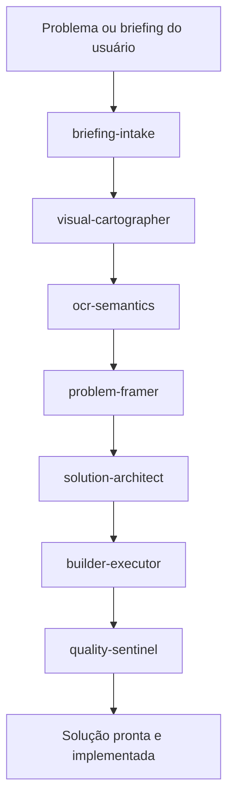
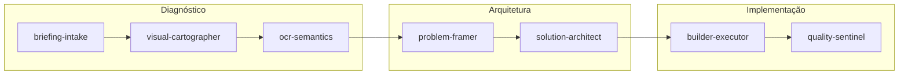
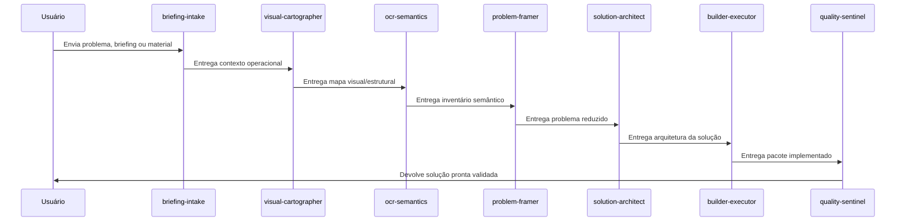
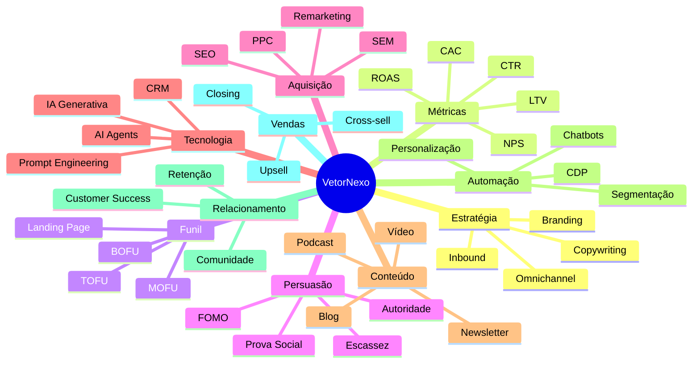

# 🚀 VetorNexo

### Squad premium para transformar marketing disperso em uma operação pronta para construir, medir, otimizar e converter.

  
  
  

---

## ✦ O que é este Squad?

**VetorNexo** é um squad multiagente criado para organizar uma operação de marketing de ponta a ponta. Ele recebe um problema, briefing, material visual ou lista de elementos estratégicos e transforma isso em uma solução operacional pronta para implementação.

A proposta central é responder, de forma prática:

> **Como uma agência de marketing pode construir, medir, otimizar e converter uma operação de marketing?**

---

## ✦ Para que serve?

O squad serve para agências, consultores, negócios digitais e equipes comerciais que precisam transformar ações soltas de marketing em um sistema estruturado.

Ele ajuda a:

- organizar estratégia, oferta, posicionamento e canais;
- desenhar funil de aquisição e conversão;
- definir métricas como CTR, CAC, LTV, ROAS, NPS, conversão, ticket médio e ARPU;
- planejar conteúdo, mídia paga, CRM, automação e vendas;
- transformar diagnóstico em plano de execução;
- entregar uma solução final clara, auditável e implementável.

---

## ✦ Visão geral do fluxo

<table>
<tr>
<td align="center"><b>Entrada</b> Briefing, problema, imagem, tabela ou operação atual</td>
<td align="center">➡️</td>
<td align="center"><b>Processamento</b> 7 agentes especializados</td>
<td align="center">➡️</td>
<td align="center"><b>Saída</b> Plano, funil, métricas, backlog e campanhas</td>
</tr>
</table>

---

## ✦ Estrutura dos agentes

### 1. `briefing-intake`
Entende o pedido inicial, identifica objetivo, público, oferta, restrições, contexto e critérios de pronto.

### 2. `visual-cartographer`
Mapeia materiais visuais, tabelas, páginas, categorias, cores, códigos, estruturas, blocos e relações entre elementos.

### 3. `ocr-semantics`
Extrai textos, termos, conceitos, métricas e significados dos materiais fornecidos, preservando evidências e incertezas.

### 4. `problem-framer`
Transforma conteúdo disperso em um problema operacional claro, priorizado e executável.

### 5. `solution-architect`
Desenha a arquitetura da solução: estratégia, funil, canais, métricas, automação, tráfego, conteúdo, vendas e relacionamento.

### 6. `builder-executor`
Constrói os entregáveis finais: plano de 30 dias, funil, campanhas, dashboard, backlog e playbooks.

### 7. `quality-sentinel`
Valida se a solução cobre todos os blocos necessários, se está coerente e se pode ser implementada.

---

## ✦ Como os agentes trabalham juntos

---

## ✦ O que o Squad entrega no final?

Ao final do fluxo, o **VetorNexo** entrega um pacote operacional composto por:

<table>
<tr>
<td><b>📌 Solução implementada</b> Documento principal com a arquitetura completa da operação.</td>
<td><b>📊 Dashboard de métricas</b> Indicadores essenciais para medir performance e conversão.</td>
</tr>
<tr>
<td><b>🧭 Plano de 30 dias</b> Roteiro semanal para implantação da operação.</td>
<td><b>🧱 Backlog de implementação</b> Lista priorizada de ações por impacto e urgência.</td>
</tr>
<tr>
<td><b>🎯 Funil e campanhas</b> Estrutura TOFU, MOFU e BOFU com ações por etapa.</td>
<td><b>✅ Validação final</b> Checagem de completude, coerência e prontidão.</td>
</tr>
</table>

---

## ✦ Blocos operacionais cobertos

---

## ✦ Resultado esperado

O resultado final não é apenas uma análise. É uma **solução operacional pronta**, capaz de orientar uma agência ou negócio na construção de uma máquina de marketing com estratégia, métricas, execução, otimização e conversão.

---

**Licença:** MIT 
**Criado por:** Marcio Bisognin 
**Instagram:** [@marciobisognin](https://instagram.com/marciobisognin)

